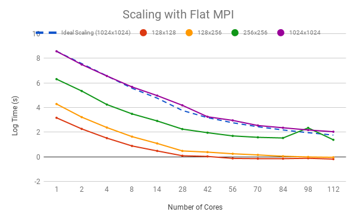
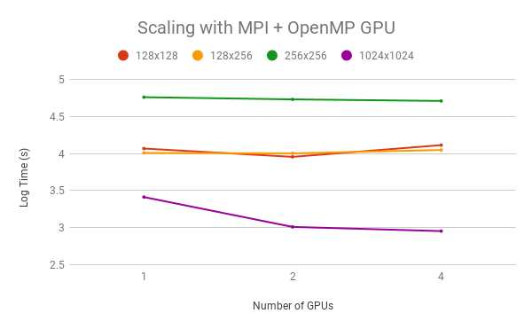

# Lattice Boltzmann Fluid Simulation

Using Intel MPI for inter-process communication and OpenMP 4.5 for parallel GPU execution.

Timings for graphs were taken on [BlueCrystal Phase 4](https://www.acrc.bris.ac.uk/acrc/phase4.htm) with the following configs

CPU - Intel Xeon E5-2680 v4  
GPU - Nvidia Tesla P100

## Parallel CPU

- **Scatter and Gather**  
    `MPI_Scatter` and `MPI_Gather` to decompose the domain by rows

- **Reduce**  
    `MPI_Reduce` for tree reductions of data across processes

- **Neighbourhood Collective**  
    Cartesian communicators and `MPI_Neighbor_alltoall` for halo exchange

- **Async Halo Exchange**  
    `MPI_Ineighbor_alltoall` allows asynchronous halo exchanges. The caveat with this is that the inner computations is O(N^2) whereas the halo exchange is O(N) so this only becomes useful on the larger problems with many cores where there is some balance between these factors due to communication overhead. It means that the CPU is not kept idle if there is a network bottleneck.


Time on multiple CPU cores across different problem grid sizes  


## Parallel GPU

OpenMP 4.5 pragmas produce CUDA code 

```
#pragma omp target update to()
```
to transfer data to the GPU and
```
#pragma omp target update from()
```
to transfer data from the GPU.  
Although these are very expensive operations and must be used sparingly.  

```
#pragma omp target teams distribute parallel for reduction(+:tot_u) collapse(2)
```
offloads work to the GPU to be executed in parallel.

Time on multiple GPUs across different problem grid sizes  


## Compiling and running

To compile type `make`. Editing the values for `CC` and `CFLAGS` in the Makefile can be used to enable different compiler options or use a different compiler. These can also be passed on the command line:

    $ make CFLAGS="-O3 -fopenmp -DDEBUG"

Input parameter and obstacle files are all specified on the command line of the `d2q9-bgk` executable.

Usage:

    $ ./d2q9-bgk <paramfile> <obstaclefile>
eg:

    $ ./d2q9-bgk input_256x256.params obstacles_256x256.dat

## Checking results

An automated result checking function is provided that requires you to load a particular Python module (`module load languages/anaconda2`). Running `make check` will check the output file (average velocities and final state) against some reference results. By default, it should look something like this:

    $ make check
    python check/check.py --ref-av-vels-file=check/128x128.av_vels.dat --ref-final-state-file=check/128x128.final_state.dat --av-vels-file=./av_vels.dat --final-state-file=./final_state.dat
    Total difference in av_vels : 5.270812566515E-11
    Biggest difference (at step 1219) : 1.000241556248E-14
      1.595203170657E-02 vs. 1.595203170658E-02 = 6.3e-11%

    Total difference in final_state : 5.962977334129E-11
    Biggest difference (at coord (6,2)) : 1.000588500943E-14
      3.329122639178E-02 vs. 3.329122639179E-02 = 3e-11%

    Both tests passed!

This script takes both the reference results and the results to check (both average velocities and final state). This is also specified in the makefile and can be changed like the other options:

    $ make check REF_AV_VELS_FILE=check/128x256.av_vels.dat REF_FINAL_STATE_FILE=check/128x256.final_state.dat
    python check/check.py --ref-av-vels-file=check/128x256.av_vels.dat --ref-final-state-file=check/128x256.final_state.dat --av-vels-file=./av_vels.dat --final-state-file=./final_state.dat
    ...

All the options for this script can be examined by passing the --help flag to it.

    $ python check/check.py --help
    usage: check.py [-h] [--tolerance TOLERANCE] --ref-av-vels-file
                    REF_AV_VELS_FILE --ref-final-state-file REF_FINAL_STATE_FILE
    ...

## Visualisation

You can view the final state of the simulation by creating a .png image file using a provided Gnuplot script:

    $ gnuplot final_state.plt
